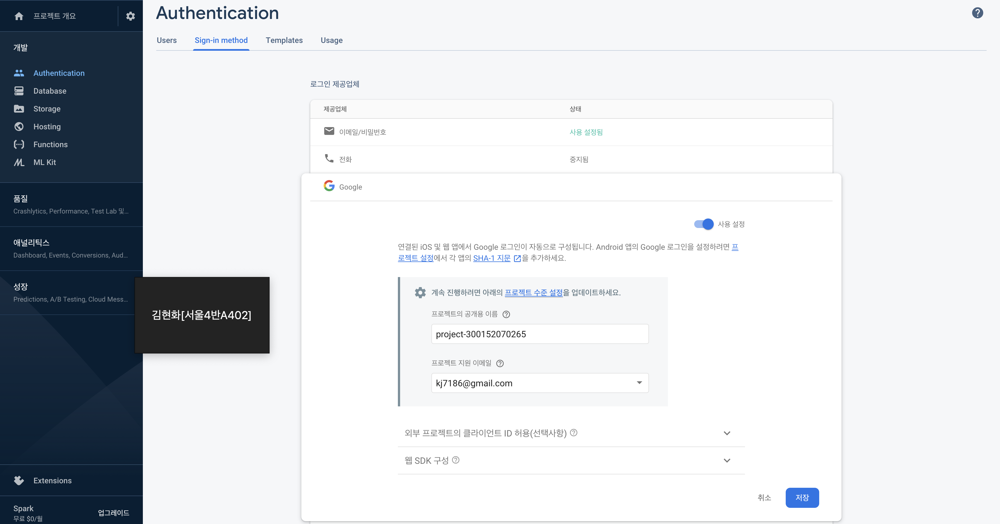
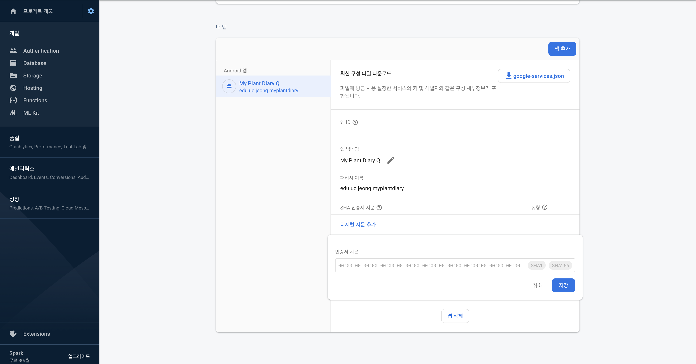
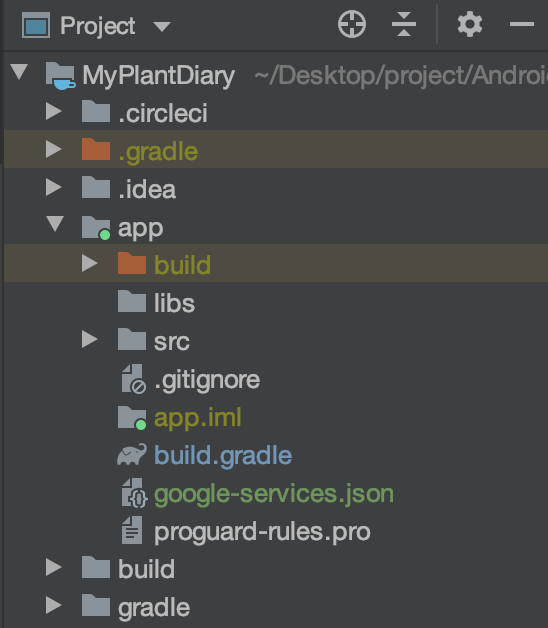

###### firebase 를 활용해서 구글 소셜 로그인을 적용하는 방법을 알아봤다.


<!-- end -->

## 적용 방법

### build.gradle(:app)

상단에 apply plugin 과 dependency 에 다음과 같이 추가한다.

```
...
apply plugin: 'com.google.gms.google-services'

android {
    ...
}

dependencies {
    ...
    // firebase authentication
    implementation 'com.firebaseui:firebase-ui-auth:6.2.0'
}
```


### build.gradle(Project)

gradle(project) 에도 다음과 같이 추가한다.

```
buildscript {
    ...
    repositories {
        google()
        ...
    }
    dependencies {
        ...
        classpath 'com.google.gms:google-services:4.3.3'
    }
}

allprojects {
    repositories {
        google()
        ...
    }
}
...
```


사실 `gradle` 에 위와 같이 추가하는 것이 `OAuth2` 적용에 필수적인 것인지는 잘은 모르겠다. *implementation 'com.firebaseui:firebase-ui-auth:6.2.0'* 를 제외하고는 구글맵을 사용했을 때 추가했던 것으로 기억한다.


### firebase 설정

#### Authentication

프로젝트를 하나 추가한 뒤 `Authentication` 에서 Google을 enable 해준다.




#### Get SHA-1 fingerprints

그 다음 내 앱에 `SHA-1 fingerprints` 를 추가해줘야 한다. 공식문서에서 보면 Java 로부터 `SHA-1 fingerprints` 를 가져오라고 명시되어 있다.

`jdk` 폴더 안 `keytool` 을 이용해야 하는데, 맥에서는 `keytool` 의 경로가 다음과 같다. `Library` 가 `root` 폴더에 있는 `Library` 임에 주의해야 한다.

```bash
/Library/Java/JavaVirtualMachines/jdk-14.0.1.jdk/Contents/Home/bin 
```


나는 이 경로에서 다음과 같은 명령어를 실행했다. 공식문서에 있는 명령어를 실행하니 오류가 나서 stackoverflow 를 찾아봤다.

```bash
keytool -list -v -keystore ~/.android/debug.keystore -alias androiddebugkey -storepass android -keypass android
```


명렁어를 실행하면, `SHA-1 fingerprints` 를 얻을 수 있다.

```bash
Alias name: androiddebugkey
Creation date: 2019. 12. 20.
Entry type: PrivateKeyEntry
Certificate chain length: 1
Certificate[1]:
Owner: C=US, O=Android, CN=Android Debug
Issuer: C=US, O=Android, CN=Android Debug
Serial number: 1
Valid from: Fri Dec 20 22:30:56 KST 2019 until: Sun Dec 12 22:30:56 KST 2049
Certificate fingerprints:
	 SHA1: xxxxxx
	 SHA256: xxxxxx
Signature algorithm name: SHA1withRSA
Subject Public Key Algorithm: 2048-bit RSA key
Version: 1

Warning:
The JKS keystore uses a proprietary format. It is recommended to migrate to PKCS12 which is an industry standard format using "keytool -importkeystore -srckeystore /Users/jngmk/.android/debug.keystore -destkeystore /Users/jngmk/.android/debug.keystore -deststoretype pkcs12".
```


#### project setting

`SHA-1 fingerprints` 를 얻었다면, 프로젝트 개요 -> 프로젝트 설정으로 들어가서 `SHA-1 fingerprints` 를 등록하면 된다.




### 프로젝트 폴더에 추가

`SHA-1 fingerprints` 를 등록했다면, 우측 상단에 있는 `google-services.json` 파일을 다운 받고, 프로젝트 `app` 폴더 안에 위치시킨다. 




### 코드 작성

다음과 같이 함수를 작성하였다. 아래 코드는 이메일과 구글계정을 이용해 로그인 할 수 있도록 작성했다.

```kotlin
private fun logon() {
        var providers = arrayListOf(
            AuthUI.IdpConfig.EmailBuilder().build(),
            AuthUI.IdpConfig.GoogleBuilder().build()
        )
        startActivityForResult(
            AuthUI.getInstance().createSignInIntentBuilder().setAvailableProviders(providers).build(), AUTH_REQUEST_CODE
        )
    }
```


### 실행

아래와 같이 실행되면 완성이다.


###### firebase 를 활용하니 간단하게 회원가입/로그인 기능을 구현해볼 수 있었다.


### 참조

- https://developers.google.com/android/guides/client-auth?hl=ko

- https://stackoverflow.com/questions/59505659/getting-fingerprint-for-android-keystore-certificate-on-mac