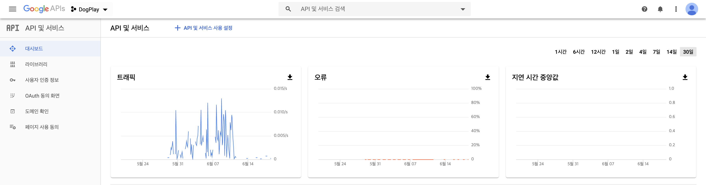
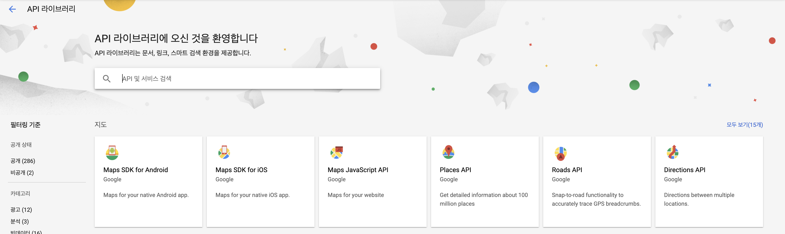
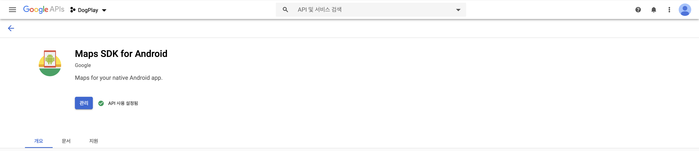
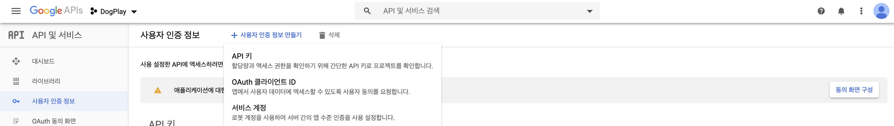
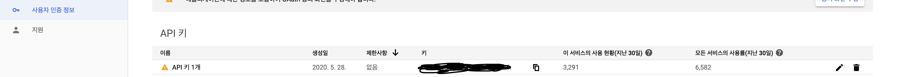
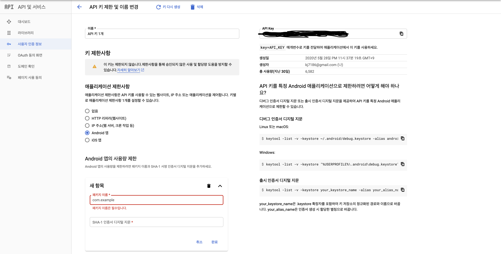

###### 구글 지도를 활용하여 현재위치로 이동하기, 현재위치에서 검색, 뷰페이저를 이용한 검색 결과 확인 기능을 구현해보았다. 

<!-- end -->


## 시연 영상


## 구현 방법

### 구글맵 사용 준비

먼저 구글 api 페이지에 접속한다.




프로젝트가 없다면 프로젝트를 생성하고, API 및 서비스 사용 설정 버튼을 누른다. `Maps SDK for Android` 를 선택하고, 만약 화면에 없다면 검색한다.




현재 추가되어 있는 상태라서 `관리` 버튼이 표시되어 있는데, 처음 사용한다면 `추가` 버튼을 눌러 추가해준다. 




사용자 인증 정보 만들기에서 API 키를 추가해준다.




추가된 API 키 오른 편에 수정 버튼을 누른다. 




애플리케이션 제한사항에서 안드로이드 앱을 선택하고, 개발중인 프로젝트의 `패키지 이름` 과 `SHA-1 fingerprints` 를 등록해준다. `SHA-1 fingerprints` 를 등록하는 방법은 [여기](https://jngmk.dev/dev/app/2020-05-22-oauth-login-with-firebase) 에서 설명한 적이 있다. 




여기까지 마쳤으면 이제 안드로이드 스튜디오로 돌아간다. `AndroidManifest.xml` 에 아래와 같이 `API_KEY` 를 추가해주자.

```xml
<application
    ...
    <meta-data
        android:name="com.google.android.geo.API_KEY"
        android:value="API_KEY" />
</application>
```


그 다음 구글 플레이 서비스를 다운받아야 한다. `Tools` -> `SDK Manager` 에 들어간 후 `SDK Tools` 에서 `Google Play Services` 를 설치한다.


그 이후 `gradle(:app)` 에 들어가서 dependencies 에 아래의 코드를 추가해준다.

```
implementation 'com.google.android.gms:play-services-maps:17.0.0'
implementation 'com.google.android.gms:play-services-location:17.0.0'
```


마지막으로 구글 지도를 사용할 xml에 가서 아래와 같이 추가해주면 구글 지도를 사용할 준비가 끝난다.

```xml
<fragment
        android:name="com.google.android.gms.maps.SupportMapFragment"
        android:id="@+id/map"
        android:layout_width="match_parent"
        android:layout_height="match_parent" />
```


### 기능 구현

#### 1. 지도 준비하기

`OnMapReadyCallback` 을 활용해서 구글맵이 준비되었을 때 `onMayReady` 함수를 `override` 하여 사전에 필요한 코드를 작업하는 것이 일반적인데, 여기서는 `getMapAsync` 함수를 사용하였다.

```kotlin
    override fun onCreateView(
        inflater: LayoutInflater, container: ViewGroup?,
        savedInstanceState: Bundle?
    ): View? {
        val layout = inflater.inflate(R.layout.map_page,container,false)
        val mapFragment = childFragmentManager.findFragmentById(R.id.map) as SupportMapFragment
        mapFragment.getMapAsync {
            googleMap -> mMap = googleMap
            mapReady = true
            updateMap()
        }
        return layout
    }
```


#### 2. 현재 위치 가져오기

현재 위치를 가져오는 코드는 **오준석의 안드로이드 생존코딩 코틀린 편** 책을 참고했다. 현재 위치를 가져오면 해당 fragment 전체에서 사용되는 현재 위치 값을 변경하고, 현재 위치 값을 기준으로 api 요청을 보낸다. 

```kotlin
		override fun onActivityCreated(savedInstanceState: Bundle?) {
        super.onActivityCreated(savedInstanceState)
        locationInit()
        ...
    }

    private fun locationInit() {
        fusedLocationProviderClient = FusedLocationProviderClient(context!!)
        locationCallback = MyLocationCallBack()
        locationRequest = LocationRequest()

        // GPS 우선
        locationRequest.priority = LocationRequest.PRIORITY_HIGH_ACCURACY
        /**
         * 업데이트 인터벌
         * 위치 정보가 없을 때는 업데이트 안 함
         * 상황에 따라 짧아질 수 있음, 정확하지 않음
         * 다른 앱에서 짧은 이터벌로 위치 정보를 요청하면 짧아질 수 있음
         */
        locationRequest.interval = 10000
        // 정확함. 이것보다 짧은 없데이트는 하지 않음
        locationRequest.fastestInterval = 5000
    }

    inner class MyLocationCallBack: LocationCallback() {
        override fun onLocationResult(locationResult: LocationResult?) {
            super.onLocationResult(locationResult)

            val location = locationResult?.lastLocation
            location?.run {
                val now = LatLng(latitude, longitude)
                // 이전에 찍힌 마커 제거
                mCurrentMarker?.remove()
                // 현재 위치 마커 추가
                mCurrentMarker = mMap.addMarker(MarkerOptions()
                    .position(now)
                    .icon(BitmapDescriptorFactory.fromResource(R.drawable.map_cur_pos_marker))
                    .title("현재위치"))
                // 제일 처음 현재위치를 가져왔을 때 카메라를 현재 위치로 이동 
                if (!mapFocus) {
                    mMap.moveCamera(CameraUpdateFactory.newLatLngZoom(now, 14f))
                    getData(latitude, longitude)
                    getCurrentAddress(latitude, longitude)
                    mapFocus = true
                }
                mMapCurLatitude = latitude
                mMapCurLongitude = longitude
            }
        }
    }
```


#### 3. 권한 검사하기 

GPS 데이터에 접근할 권한을 요청하고 요청했을 경우, GPS 데이터를 가져온다. 수명주기를 고려하여 LocationListener 이벤트를 추가하고 제거해준다.

```kotlin
    override fun onResume() {
        super.onResume()
        permissionCheck()
    }

    private fun permissionCheck() {
        // 위치 권한이 있는지 검사
        if (ContextCompat.checkSelfPermission(context!!, android.Manifest.permission.ACCESS_FINE_LOCATION) != PackageManager.PERMISSION_GRANTED) {
            // 권한이 허용되지 않음
            if (ActivityCompat.shouldShowRequestPermissionRationale(activity!!, android.Manifest.permission.ACCESS_FINE_LOCATION)) {
                Toast.makeText(context, "현재 위치 정보를 업데이트 하기 위해선 위치 권한이 필요합니다.", Toast.LENGTH_LONG).show()
            }
            // 권한 요청
            else {
                ActivityCompat.requestPermissions(activity!!, arrayOf(android.Manifest.permission.ACCESS_FINE_LOCATION), REQUEST_ACCESS_FINE_LOCATION)
            }
        }
        // 권한을 수락했을 때
        else {
            addLocationListener()
        }
    }

    private fun addLocationListener() {
        fusedLocationProviderClient.requestLocationUpdates(locationRequest, locationCallback, null)
    }

    override fun onRequestPermissionsResult(
        requestCode: Int,
        permissions: Array<out String>,
        grantResults: IntArray
    ) {
        super.onRequestPermissionsResult(requestCode, permissions, grantResults)
        when (requestCode) {
            REQUEST_ACCESS_FINE_LOCATION -> {
                // 권한 허용됨
                if (grantResults.isNotEmpty() && grantResults[0] == PackageManager.PERMISSION_GRANTED) {
                    addLocationListener()
                }
                // 권한 거부
                else {
                    Toast.makeText(context, "권한이 거부되었습니다.", Toast.LENGTH_LONG).show()
                }
            }
        }
    }

    override fun onPause() {
        super.onPause()
        removeLocationListener()
    }

    private fun removeLocationListener() {
        fusedLocationProviderClient.removeLocationUpdates(locationCallback)
    }
```


#### 4. 데이터 가져오기

```kotlin
    private fun getData(latitude: Double = 37.4979, longitude: Double = 127.0276) {
        val server = API.server()
        // 근처에 있는 호텔 정보 가져오기
        server!!.getHotelNearBy(DISTANCE, latitude, longitude).enqueue(object : Callback<HotelNearByDTO> {
            		...
            }

            override fun onResponse(call: Call<HotelNearByDTO>, response: retrofit2.Response<HotelNearByDTO>) {
                ...
            }
        })
    }
```


#### 5. 위도 경도 값으로 현재 주소 가져오기

`geocoder` 를 활용하여 현재 주소를 가져온다. 현재 주소를 가져오는데 성공하면 `mutableLiveData` 로 주소 값을 관리한다.

```kotlin
    private fun getCurrentAddress(latitude: Double, longitude: Double) {
        val geocoder = Geocoder(context, Locale.KOREA)

        try {
            val addresses = geocoder.getFromLocation(latitude, longitude, 5)

            if (addresses == null || addresses.size == 0) {
                Toast.makeText(context, "현재 주소를 찾을 수 없습니다.", Toast.LENGTH_LONG).show()
            } else {
                val address = addresses[0].getAddressLine(0).toString()
                MutableSupplier.currentAddress.postValue(address)
            }
        } catch (ioException: IOException) {
            Toast.makeText(context, "네트워크 문제가 발생했습니다. 다시 시도해주세요.", Toast.LENGTH_LONG).show()
        } catch (illegalArgumentException: IllegalArgumentException) {
            Toast.makeText(context, "잘못된 GPS 접근입니다. 다시 시도해주세요.", Toast.LENGTH_LONG).show()
        }
    }
```


#### 6. 현재 위치로 카메라 이동 및 현재 위치에서 검색

```kotlin
    override fun onActivityCreated(savedInstanceState: Bundle?) {
        super.onActivityCreated(savedInstanceState)
        ...
      	// 현재 위치에서 검색
        btnSearchHotelNearBy.setOnClickListener {
            // 지도 중앙 값
            val centerLatLng:LatLng = mMap.projection.visibleRegion.latLngBounds.center
            getData(centerLatLng.latitude, centerLatLng.longitude)
        }
      	// 현재 위치로 이동
        btnGoCurPos.setOnClickListener {
            if (mMapCurLatitude != null && mMapCurLongitude != null) {
                mMap.moveCamera(CameraUpdateFactory.newLatLngZoom(LatLng(mMapCurLatitude!!, mMapCurLongitude!!), 14f))
            }
        }
    }
```


#### 7. 뷰페이저에서 페이지를 이동할 때마다 마커와 카메라 이동, 마커 클릭으로 뷰페이저 페이지 전환

마커를 클릭하여 뷰페이저 페이지를 이동하는 기능은 `구글맵` 에서 `setOnMarkerClickListener` 를 호출했다. 이 listener 는 return 값으로 `boolean` 형식을 기대하기 때문에 마지막에 `true` 를 return 했다.

뷰페이저에서 페이지를 이동할 때 현재 포커싱 되어있는 마커를 변경해주고 카메라를 이동시켜주기 위해서는 `OnPageChangeCallback` 함수를 이용했다. 다음과 같이 `hotelPageChangeCallback` 를 구현하고, `mPager.registerOnPageChangeCallback(hotelPageChangeCallback)` 로 적용하였다. 

```kotlin
    override fun onCreateView(
        inflater: LayoutInflater, container: ViewGroup?,
        savedInstanceState: Bundle?
    ): View? {
        val layout = inflater.inflate(R.layout.map_page,container,false)
        val mapFragment = childFragmentManager.findFragmentById(R.id.map) as SupportMapFragment
        mapFragment.getMapAsync {
            ...
            updateMap()
        }
        // view pager
        mPager = layout.findViewById(R.id.mapHotelViewPager)
    }

		// 마커 클릭 이벤트
    private fun updateMap() {
        if (mapReady) {
            mMap.setOnMarkerClickListener {
                    marker ->
                if (marker.tag != null) {
                    mPager.currentItem = marker.tag as Int
                }
                true
            }
        }
    }

		...

		// 페이지 전환 이벤트
    private var hotelPageChangeCallback = object : ViewPager2.OnPageChangeCallback() {
        override fun onPageSelected(position: Int) {
            // 이전 포커싱 초기화
            if (mPrevPosition != null) {
                mMarkers[mPrevPosition!!].remove()
                val hotel = hotels[mPrevPosition!!]
                val marker = mMap.addMarker(MarkerOptions()
                    .position(LatLng(hotel.latitude, hotel.longitude))
                    .icon(BitmapDescriptorFactory.fromResource(R.drawable.map_marker))
                    .title(hotel.hotelname))
                marker.tag = mPrevPosition!!
                mMarkers.add(mPrevPosition!!, marker)

            }
            // 현재 포커싱
            mMarkers[position].remove()
            val hotel = hotels[position]
            val marker = mMap.addMarker(MarkerOptions()
                .position(LatLng(hotel.latitude, hotel.longitude))
                .icon(BitmapDescriptorFactory.fromResource(R.drawable.map_selected_marker))
                .title(hotel.hotelname))
            marker.tag = position
            mMarkers.add(position, marker)
            mMap.moveCamera(CameraUpdateFactory.newLatLng(LatLng(hotel.latitude, hotel.longitude)))

            mPrevPosition = position
        }
    }
```

